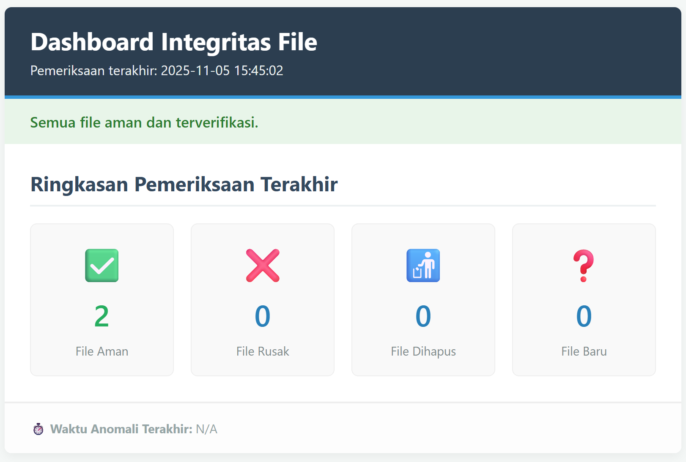
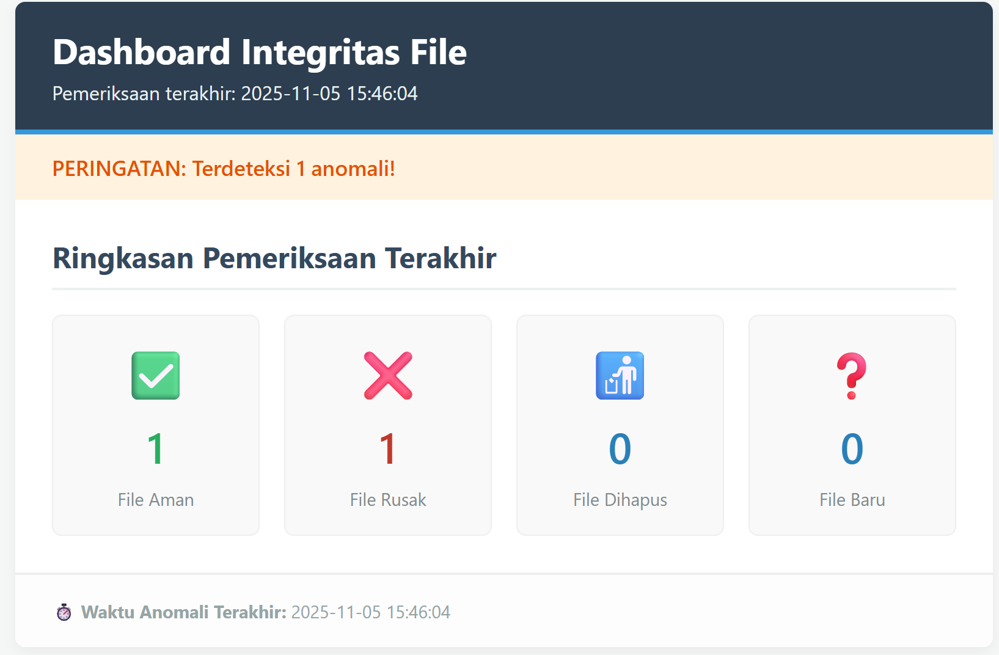

# Sistem Monitor Integritas File (FIM) Sederhana

Ini adalah proyek Python sederhana untuk memantau integritas file dalam sebuah folder. Sistem ini dapat mendeteksi penambahan, penghapusan, atau modifikasi file dengan melacak hash SHA-256 mereka.

Proyek ini terdiri dari dua bagian:

1. `monitor.py`: Alat baris perintah (CLI) untuk membuat _baseline_ (database hash), memeriksa file, dan mencatat semua aktivitas ke `security.log`.
2. `web_monitor.py`: Dashboard web mini (Flask) untuk memvisualisasikan laporan status terakhir dari file log.

## ✨ Fitur

- **Pemantauan Folder:** Mendeteksi file yang **diubah**, **dihapus**, atau **ditambahkan**.
- **Verifikasi Integritas:** Menggunakan hash SHA-256 untuk membandingkan status file saat ini dengan _baseline_ yang aman (`hash_db.json`).
- **Logging Komprehensif:** Mencatat semua aktivitas (level `INFO`, `WARNING`, `ALERT`) ke `security.log`.
- **Laporan CLI:** Menyediakan ringkasan cepat di terminal (`--report`).
- **Dashboard Web:** Menampilkan status pemantauan terakhir secara visual di browser.

## Visualisasi Dashboard

Dashboard web memberikan gambaran visual cepat tentang status pemeriksaan terakhir.

**Kondisi Aman:**


**Kondisi Peringatan (Setelah Anomali Terdeteksi):**


## ⚙️ Persyaratan

- Python 3.x
- Flask (hanya untuk dashboard web)
- Modul standar Python: `os`, `sys`, `json`, `hashlib`, `logging`

## 🚀 Instalasi

1. Salin file `monitor.py` dan `web_monitor.py` ke direktori proyek Anda.
2. Install Flask menggunakan pip:

   ```bash
   pip install Flask
   ```

3. Buat folder yang ingin Anda pantau. Skrip ini dikonfigurasi untuk memantau folder `./secure_files/`.

   ```bash
   mkdir secure_files
   ```

## 📁 Struktur File yang Direkomendasikan

```
/proyek-monitor-file/
├── monitor.py           \# Skrip monitor CLI utama
├── web_monitor.py       \# Skrip dashboard web Flask
├── secure_files/        \# Folder yang dipantau
│   ├── file_aman_1.txt
│   └── ...
├── hash_db.json         \# (Dibuat otomatis oleh --init)
├── security.log         \# (Dibuat otomatis oleh --check)
└── README.md            \# File ini
```

## 🛠️ Penggunaan

Sistem ini memiliki dua mode operasi: alat CLI dan server web.

### 1. Alat Baris Perintah (`monitor.py`)

Alat ini digunakan untuk mengelola baseline dan menjalankan pemeriksaan.

#### `--init` (Inisialisasi Baseline)

Perintah ini memindai folder `secure_files/`, menghitung hash setiap file, dan menyimpannya di `hash_db.json`. Lakukan ini **hanya** saat Anda yakin file-file di dalamnya dalam keadaan bersih dan aman.

```bash
# Tambahkan file aman Anda ke folder secure_files/
echo "database_connection = 'prod'" > secure_files/config.ini
echo "user1:pass123" > secure_files/users.txt
# Jalankan --init untuk membuat baseline
python monitor.py --init
```

**Output:**
`Baseline berhasil dibuat untuk 1 file.`

#### `--check` (Periksa Integritas)

Perintah ini memindai folder `secure_files/` lagi dan membandingkan hash saat ini dengan yang ada di `hash_db.json`.

- Jika semua cocok, log `INFO` akan dicatat di `security.log`.
- Jika ada perbedaan (file diubah, dihapus, atau ditambahkan), log `WARNING` atau `ALERT` akan dicatat di `security.log` **dan** ditampilkan di konsol.

<!-- end list -->

```bash
# Jalankan pemeriksaan
python monitor.py --check
```

**Output (jika ada anomali):**

```
[2025-11-05 12:10:30] WARNING: File "config.ini" integrity failed!
[2025-11-05 12:10:30] ALERT: Integritas file "config.ini" gagal (Hash mismatch).
[2025-11-05 12:10:30] ALERT: Unknown file "hacked.js" detected.
Pemeriksaan integritas selesai. Lihat 'security.log' untuk detail.
```

#### `--report` (Lihat Laporan CLI)

Perintah ini membaca `security.log` dan menampilkan ringkasan sederhana dari **pemeriksaan terakhir** di terminal.

```bash
python monitor.py --report
```

**Output:**

```
--- 📜 Laporan Log Keamanan (Pemeriksaan Terakhir) ---
✅ File Aman (terverifikasi): 0
❌ File Rusak (termodifikasi): 1
🚮 File Dihapus:             0
❓ File Baru (mencurigakan): 1
-------------------------------------------------
⏱️ Waktu Anomali Terakhir:   2025-11-05 12:10:30
```

### 2. Dashboard Web (`web_monitor.py`)

Jalankan server Flask ini di terminal terpisah untuk memantau status secara visual.

1. **Jalankan server web:**

   ```bash
   python web_monitor.py
   ```

   Output:
   `Menjalankan Flask Web Server di http://1227.0.0.1:5000`

2. **Buka browser Anda** dan akses `http://127.0.0.1:5000`.

Dashboard akan menampilkan status dari _pemeriksaan terakhir_ yang dicatat di `security.log`. Halaman ini akan di-refresh secara otomatis setiap 30 detik, tetapi data hanya akan diperbarui setelah Anda menjalankan `python monitor.py --check` lagi di terminal lain.

---

## 🔄 Contoh Alur Kerja (Simulasi Serangan)

1. **Terminal 1 (Jalankan Web Server):**

   ```bash
   python web_monitor.py
   ```

2. **Terminal 2 (Setup Awal):**

   ```bash
   # Buat folder dan file bersih
   mkdir secure_files
   echo "config_awal" > secure_files/config.txt
   echo "data_penting" > secure_files/data.db

   # Buat baseline
   python monitor.py --init

   # Jalankan pemeriksaan pertama (semua aman)
   python monitor.py --check
   ```

   - **Hasil Web:** Refresh browser Anda. Dashboard akan berwarna hijau dan menampilkan "Semua file aman".

3. **Terminal 2 (Simulasi Serangan):**

   ```bash
   # 1. Modifikasi file
   echo "data dirusak" >> secure_files/data.db
   # 2. Hapus file
   rm secure_files/config.txt
   # 3. Tambahkan file baru
   echo "virus" > secure_files/virus.exe
   ```

4. **Terminal 2 (Jalankan Pemeriksaan Deteksi):**

   ```bash
   python monitor.py --check
   ```

   - **Hasil Terminal:** Anda akan melihat `WARNING` dan `ALERT` untuk ketiga file tersebut.

5. **Browser (Lihat Hasil):**

   - **Hasil Web:** Refresh browser Anda. Dashboard sekarang akan berwarna oranye/merah, dan menunjukkan:

     - File Rusak: 1
     - File Dihapus: 1
     - File Baru: 1

<!-- end list -->
